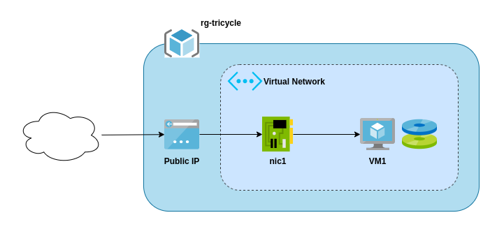
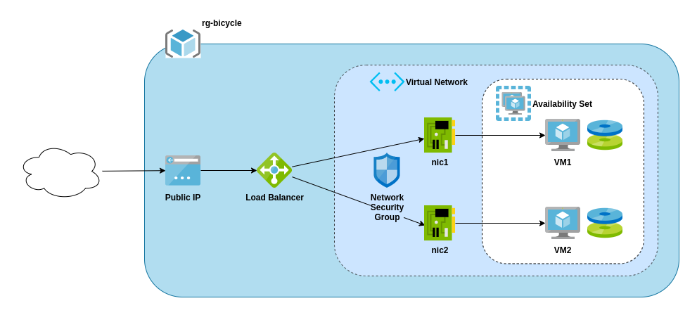

# Intro to Idem for Azure

## Installing idem-azurerm
Install into a Python 3.6 or greater virtual environment.
```bash
$ python3 -m venv env

$ source env/bin/activate

(env) $ pip3 install idem-azurerm==2.2.0
```

## Setting up credentials in acct
Edit a credentials file, using `myawesomecreds.yml` as an example:
```bash
(env) $ vim credentials.yml
```
**DO NOT COMMIT YOUR CREDENTIALS FILE TO GIT!**

Run `acct` to encrypt your credentials file:
```bash
(env) $ acct credentials.yml
New encrypted file created at: credentials.yml.fernet
The file was encrypted with this key:
pqJ3YHBrE1miz3TBZr5ebcmuAg2qwSys1lU7GnEC4yQ=
```
...and then export the environment variables for the key used for encryption
and your encrypted file location:
```bash
(env) $ export ACCT_KEY="pqJ3YHBrE1miz3TBZr5ebcmuAg2qwSys1lU7GnEC4yQ="

(env) $ export ACCT_FILE="/path/to/credentials.yml.fernet"
```

## Creating the "tricycle" infrastructure
Running the following command:
```bash
(env) $ idem state tricycle.sls
```
...creates something like this:



## Creating the "bicycle" infrastructure
Running the following command:
```bash
(env) $ idem state bicycle.sls
```
...creates something like this:



## The "unicycle"...
Play with this at your own risk. This is really just here to show *that* you
can integrate `idem-azurerm` into any POP apps/plugins... not *how* you should
do it. It's pretty hacky and not even really a good use case.

## POP Projects
* https://gitlab.com/saltstack/pop
* https://gitlab.com/saltstack/pop/pop-awesome

## References
* https://eitr.tech/blog/2020/05/07/Getting-Started-with-Idem-for-Microsoft-Azure.html
* https://eitr.tech/blog/2020/05/15/idem-for-microsoft-azure-2.1-update.html
* https://pop-book.readthedocs.io/en/latest/
* https://pop.readthedocs.io/en/latest/
* https://idem.readthedocs.io/en/latest/
* https://gitlab.com/saltstack/pop
* https://github.com/eitrtechnologies/idem-azurerm
* https://idem-azurerm.readthedocs.io/en/latest/
* https://github.com/nicholasmhughes/idem-azurerm-intro

